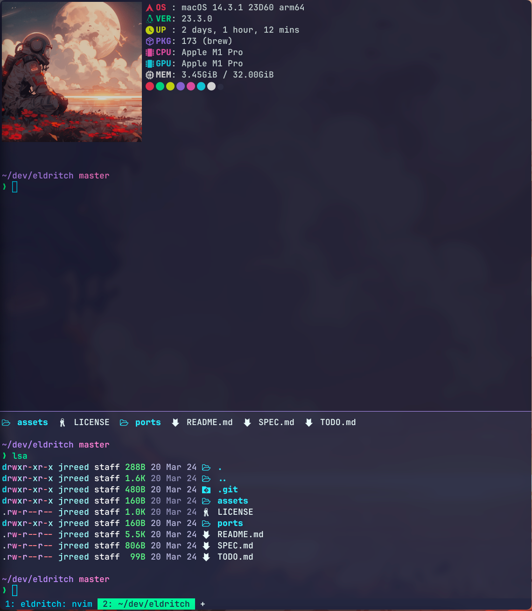

<p align="center">

</p>
<p>
Eldritch is a community-driven dark theme inspired by Lovecraftian horror. With tones from the dark abyss and an emphasis on green and blue, it caters to those who appreciate the darker side of life.
</p>

### Showcase
<br/>

### Installation
1. Download the `eldritch.toml` file from this directory.
2. Place it in `~/.config/wezterm/colors/eldritch.toml` (or wherever your wezterm configuration is located).
3. In your wezterm.lua file, add the following line:
```lua
-- The following two lines you probably already have, so skip those if you do
local wezterm = require("wezterm")
local config = wezterm.config_builder()

config.color_scheme = "Eldritch"
```
